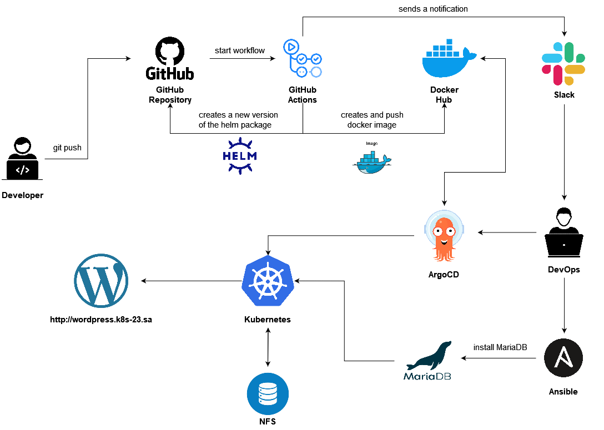

# Project report

**Project's reporter:** Nickolai Vabishchevich

**Group number:** md-sa2-23-23

## Description of application for deployment

**Name of application:** Wordpress

**Which programming language is this application written in:** PHP

**What kind of DB:** MariaDB

## Pipeline. High Level Design

## Technologies which were used in project

**Orchestration:** Kubernetes

**Automation tools:** Ansible, GitHub Actions, ArgoCD

**Other uses tools:** HELM, Docker, MariaDB

**SCM:** Github

**Notification:** Slack

**CI description:** 

**Deployment flows short description:**

## Links

[Project Repository](https://github.com/nickvab/app_for_project)

[DockerHub Registry](https://hub.docker.com/repository/docker/nickvab/wordpress/general)
